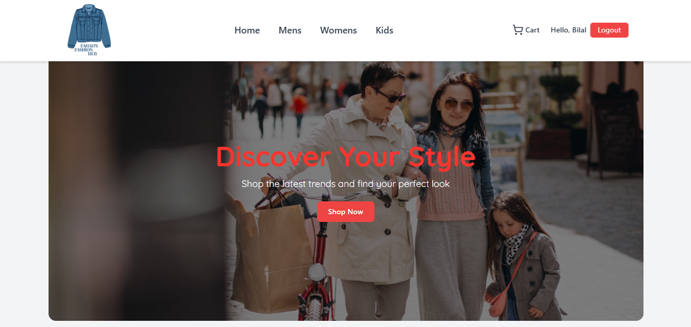

## Fahad Fashion Hub

🌟 Overview

Fahad Fashion Hub is a modern and responsive e-commerce platform built with React and Vite, offering a seamless online shopping experience for fashion enthusiasts.
Users can browse Men’s, Women’s, and Kids’ clothing collections, add items to their cart, and place orders with ease.

This project emphasizes real-time data management, secure authentication, and mobile-first UI design — ensuring a smooth and elegant shopping experience across all devices.

✨ Features

🧥 Browse collections for Men, Women, and Kids

🛒 Add to Cart and manage quantities dynamically

💳 Place Orders with Cash on Delivery or Razorpay Payment Gateway

🔐 User Authentication and Registration via Firebase Auth

🧾 Real-time Order Tracking and Firestore database integration

📱 Responsive Design for Mobile, Tablet, and Desktop

⚡ Interactive UI with hover effects and transitions

🔔 Modern Notifications powered by react-hot-toast

🧠 Tech Stack

## Frontend:

React

Vite

Tailwind CSS

Lucide Icons

## Backend / Database:

Firebase Firestore

Firebase Authentication

## Payment Integration:

Razorpay

## Routing & State Management:

React Router

React Context API

# Notifications:

react-hot-toast

🧰 Tools Used

VS Code – Development Environment

Git & GitHub – Version Control

Chrome DevTools – Testing & Debugging

Tailwind CSS – Styling Framework

Firebase Console – Database & Authentication Management

🚀 How to Use

Open the app and browse through various clothing categories.

Add desired items to your shopping cart.

Proceed to checkout (login required).

Choose your preferred payment method (COD or Razorpay).

Place your order and receive instant confirmation via toast notifications.

🧩 How to Run Locally
# Clone the repository
git clone https://github.com/your-username/fahad-fashion-hub.git

# Navigate into the project directory
cd fahad-fashion-hub

# Install dependencies
npm install

# Start the development server
npm run dev

📫 Contact

Developed by: Fahad Akhtar
📍 Ranchi, India
✉️ support@fahadfashionhub.com

📞 +91 8085509001
